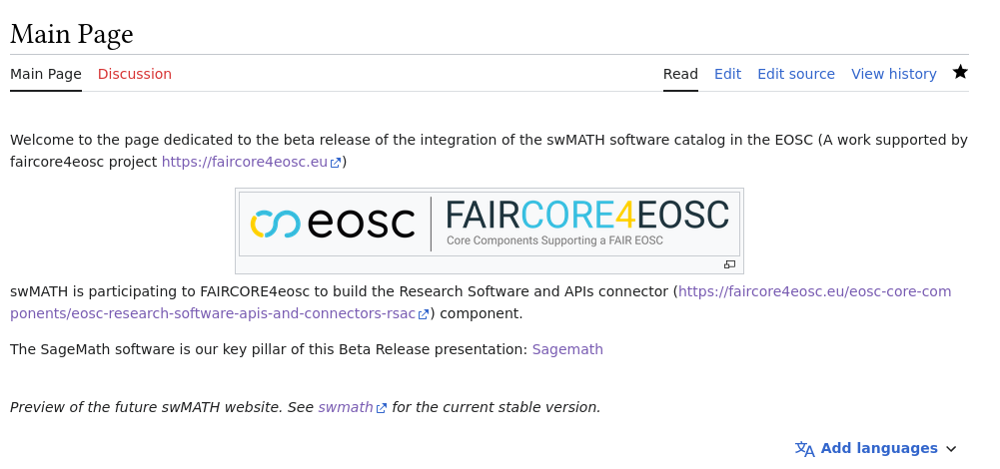
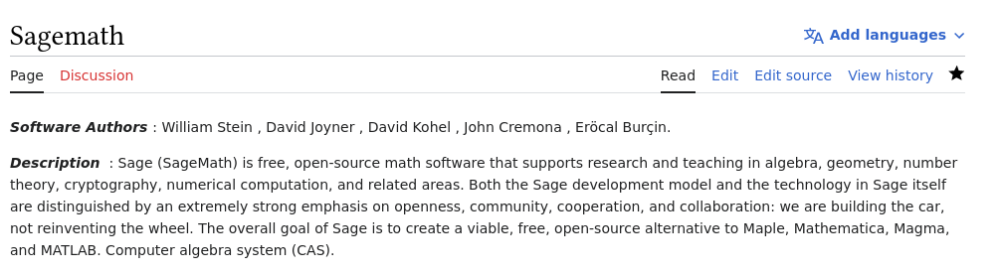
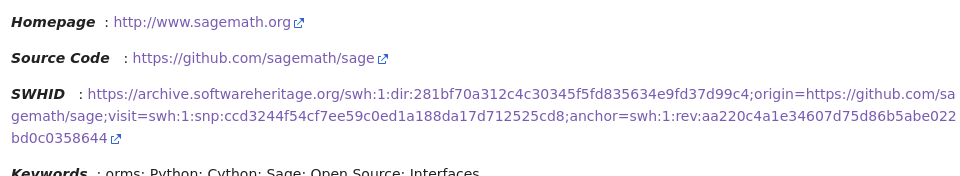
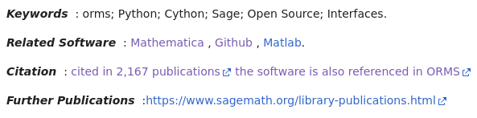
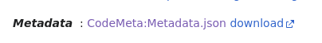
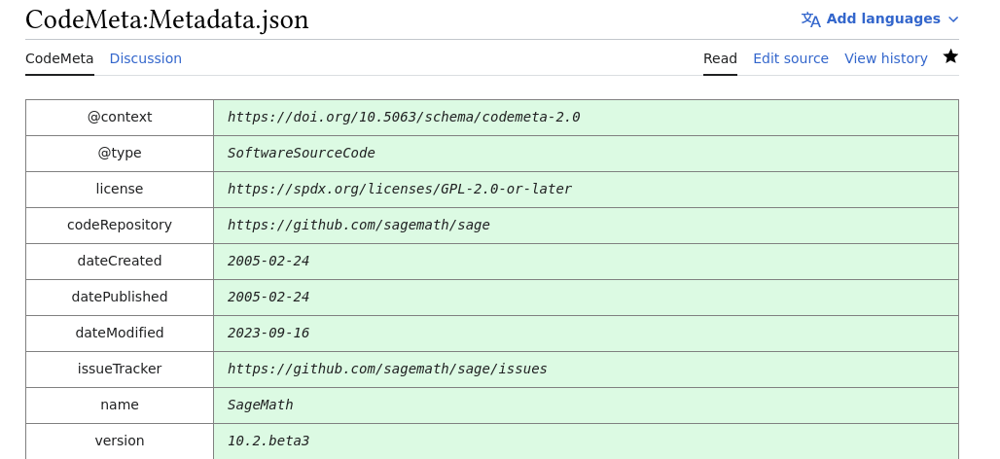

This documentation intends to be helpful for the users of the swMATH interface:

swMATH is a database of mathematical software metadata.

It indexes software identified in publication or software cited in zbMATH publications.

swMATH is displayed through a Mediawiki instance of the MaRDI (https://www.mardi4nfdi.de//about/mission) infrastructure.

The Mediawiki interface provides a research bar. 
For this beta release, the SageMath software is findable through the search bar as well as the hyperlink displayed on the homepage.

Then the SageMath authors and descriptions are visible.

Both source code and intrinsic identifier are available.
Specifically, the selected SWHID is contextual, and relates to a specific snapshot, fixing so a specific commit and a specific number of visitors.

Other metadata information as keywords about the languages used to program the software, or other domain related keywords are provided.
Software covering same topics are displayed. 
We also provide the number of times a software is cited and external resources about related articles. 

We provide a link to the metadata of the software, displayed in the Codemeta vocabulary.
These ones are available in the Codemeta.json format and downloadable as well.

Metadata are represented in a table thanks to features of MediaWiki to display json files content.
Even more metadata are available there, like metadata vocabulary specifications, software licenses, release dates, etc.

Any feedback on this documentation are welcome. If needed, create an issue.